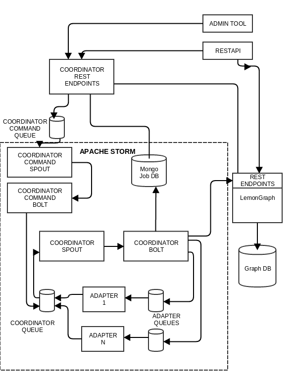
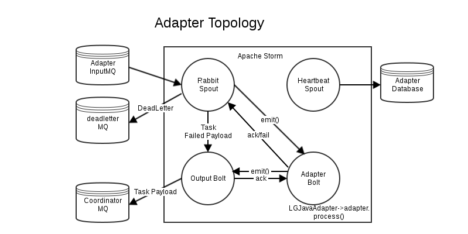

# LemonGrenade

LemonGrenade was designed as an automation system capable of smartly linking together systems, data sources, or capabilities - or combinations of such - without requiring the end-user manually specify linkages. The driving concept is let the data drive the dataflow; instead of a box-and-line workflow, the data and end-user intent drives a dynamic process without relying on process dependency lists.  LemonGrenade offers an alternative to precomputation of graphs, instead building graphs on demand from data sources or processes.  Use cases include iterative correlation and recursive file processing.



At its core, LemonGrenade ties one or more adapters together in a fluid framework.  These adapters receive tasking from controllers, which process jobs as submitted to the system.  Each job receives its own handling graph, to track processing stages and match data to adapters, as well as track new data inserted into the system through adapter returns.  The graph is implemented through LemonGraph, a custom graph library implemented for LemonGrenade; LemonGraph rides on top of (and inherits a lot of awesome from) Symas LMDB - a transactional key/value store that the OpenLDAP project developed to replace BerkeleyDB.  Job state is stored in MongoDB, and interacted with through a RestAPI.



LemonGrenade is customized with its adapters.  Example adapters are provided to show the framework for extending the base adapters.

This initial release is considered a Technical Preview and thus should not be considered stable in terms of functionality or APIs. 

# Installation
* LemonGrenade is supported under Linux only (Tested under Centos7 and Ubuntu 15.10)
* Install Java 8 (Tested under 8u45)
* Install Python (Tested under 2.7)
* [Optional] Install NodeJS (tested under 4.2.2)
* Download Apache Zookeeper from http://www.apache.org/dyn/closer.cgi/zookeeper/ (Tested against 3.4.8)
    * You'll need to create a conf/zoo.cfg. Make sure you change the dataDir to something that isn't /tmp
* Start Apache Zookeeper
    * bin/zkServer.sh start
* Download Apache Storm from http://storm.apache.org/ (Tested against 1.0.1)
    * In the conf, make sure you set ports for the supervisor daemon to use. You'll need 1 port for LemonGrenade itself and then 1 additional port per adapter you want to launch. None of these ports need to be exposed unless you're clustering storm. Memory usage can be configured based on your hardware. 
    ```
        supervisor.slots.ports:
         - 6701
         - 6702
         - 6703
         - 6704
        
        supervisor.childopts: "-Xmx256m"
        worker.childopts: "-Xmx512m"
        
        topology.spout.wait.strategy: "org.apache.storm.spout.SleepSpoutWaitStrategy"
        topology.sleep.spout.wait.strategy.time.ms: 1000
    ```
* Start Apache Storm
    * bin/storm nimbus
    * bin/storm supervisor
    * [Optional] bin/storm ui
    * [Optional] bin/storm logviewer
* Download MongoDB (Tested under 3.2.4)
    * bin/mongod --dbpath /your/data/dir
* Redis (Tested against 3.0.3)
    * sudo apt-get install redis
    * sudo service redis-server start
* LemonGraph
    * git clone <URL>
    * cd lemongraph
    * make
    * python -m LemonGraph.server

This is a bigger dependency list than we'd like and we're looking to shrink it down, some thoughts we've had:
 * Redis usage is light enough it could be folded into a Mongo collection (this will be done in the next release)
 * There's the potential to move all of the job tracking from Mongo into LemonGraph (completely removing Mongo as a dependency)
 * Storm has been great so far, but the hard depenency on Zookeeper is just another thing to install
    
# Building the source code
* [Optional] Install Maven (tested under 3.3.3)
* [Optional] Install Storm-RabbitMQ Driver 
    * They've updated this on their GitHub, but haven't pushed to Maven Central yet. If you want to compile the source code you'll need to do this step. 
        * git clone https://github.com/ppat/storm-rabbitmq.git
        * mvn clean install
* [Optional] Build the source code
    * mvn -P deploy clean install

# Selecting LemonGrenade Graph Operating Modes
You have two ways to run Lemongrenade:
<ol>
<li>Internal Simple Graph/Diff engine
<li>LemonGraph
</ol>

To set which way you want to run, look at conf/lemongrenade.props:

<pre>
# Graph Store
# valid graph modes are internal,lemongraph
coordinator.graphstore=lemongraph
</pre>

If you are using lemongraph, make sure that the lemongraph engine is running:

<pre>
cd lemongraph
python -m LemonGraph.server
</pre>

	
# License

LemonGrenade is released under the Apache 2.0 license.
